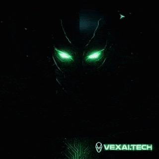

# VEX — Solana AI Agent

> Real-time Solana wallet ops. Oracle intelligence. Terminal-based execution.  
> Built for builders who don’t ask permission.


---

## 🎬 VEX in Action




---

## 🧠 What is VEX?

**VEX** is an AI-powered Solana Agent built to interface with the blockchain using natural language commands. It supports real-time operations like wallet generation, price checking, and smart transaction execution.

> VEX is not a chatbot.  
> It's a command interface to the Solana machine.

---

## ⚙️ Features

### 💬 Natural Language Chat
- Interact with the Solana blockchain using simple English.
- Ask about tokens, wallets, or execute commands.

### 🔐 Wallet Generation
- Secure, instant wallet creation.
- One-click copy and save.

### 📈 Price Checker
- Real-time token pricing using RPC oracles.

### ⚡ Transaction Execution
- Simulate before you commit (coming soon).

### 🧙‍♂️ Agent Modes
> 🧙‍♂️ Modes:   

- **Oracle Mode** — Real-time blockchain analytics.
- **Hacker Mode** — Advanced command-line operations.
- **Trader Mode** — Execute trades, monitor wallets.

---

## 🛠️ Tech Stack

- `React`, `TailwindCSS`, `Framer Motion`
- `Solana-agent-kit`, `OpenAI`, `Solana RPC`
- Vite build system

---

## 🚀 Getting Started

```bash
git clone https://github.com/vex-ai/vex-ai.git
cd vex-ai
npm install
npm run dev
```

> Make sure to add your `.env` with OpenAI and Solana RPC keys.

---

<details>
<summary>🧠 How It Works (click to expand)</summary>

VEX parses your natural language input using OpenAI, then matches it to blockchain operations through the Solana Agent Kit SDK. It can generate wallets, check token prices, and initiate transactions — all via a terminal-style AI chat.

</details>

---

## 🧪 Project Structure

```
vex-ai/
├── frontend/
│   ├── src/
│   └── public/
├── backend/ (optional)
│   ├── agent/
│   └── .env.example
├── demo/
│   └── vex-demo.gif
├── docs/
│   ├── architecture.md
│   ├── api.md
│   └── usage.md
├── .gitignore
├── LICENSE
└── README.md
```

---

## 📡 Live Demo

Check it out at [vexai.tech](https://vexai.tech)

---

## 🤝 Contributing

Feel like upgrading the agent?
- Fork
- Clone
- Create a branch
- Submit a pull request

Logs are open.

---
---

## 🔗 GitHub Repo

[https://github.com/vex-ai-agent/vex-ai](https://github.com/vex-ai-agent/vex-ai)
